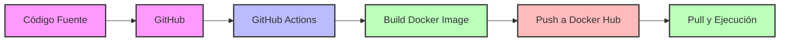
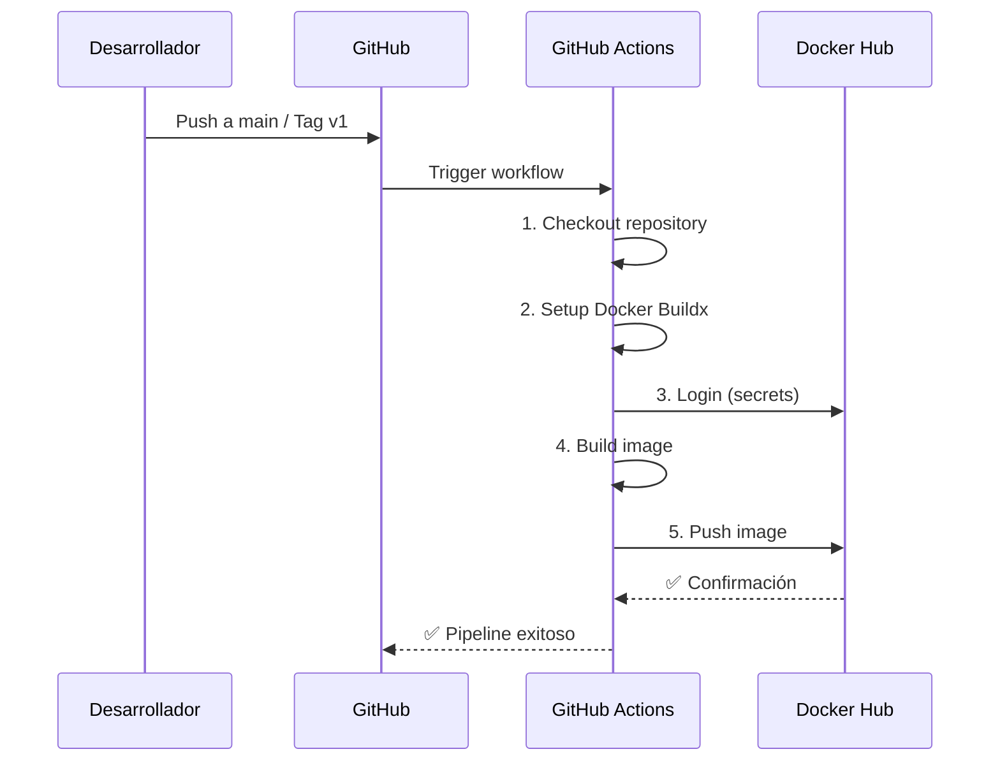

# 🚀 Proyecto Final DevOps

[](https://hub.docker.com/r/tu-usuario/devops-final-project)
[](https://github.com/tu-usuario/tu-repo/actions)
[](https://fastapi.tiangolo.com/)
[](https://www.python.org/)

---

## 📃Resumen Ejecutivo

| Elemento | Descripción |
| --- | --- |
| Proyecto | Aplicacion web desarrollada con FastAPI para el Trabajo Final DevOps |
| Objetivo | Despliegue mediante GitHub Actions |
| Enfoque técnico | Desarrollo por ramas con Gitflow, publica la imagen en Docker Hub mediante GitHub Actions |
| Versión entregable | `v1.0.0` |
| Autores | Oscar Maldonado, Daniel Alquinga |

---

## ✳️ Descripción del Proyecto

Aplicacion web desarrollada con FastAPI para el Trabajo Final DevOps. El proyecto construye una imagen Docker, publica la imagen en Docker Hub mediante GitHub Actions y expone una pagina de verificacion con informacion del grupo y del contenedor.

---

## 📚Funcionalidades

- ✅ **Contenerización** con Docker
- ✅ **Integración Continua** con GitHub Actions
- ✅ **Publicación automatizada** en Docker Hub
- ✅ **Infraestructura como Código** (Dockerfile)
- ✅ **Health Checks** para monitoreo
- ✅ **Variables de entorno** para configuración
---

## 🏛️ Componentes del Sistema

| Componente | Tecnología | Función |
|------------|------------|---------|
| **Código Fuente** | Python + FastAPI | Lógica de la aplicación web |
| **Control de Versiones** | GitHub | Almacenamiento y versionado del código |
| **CI/CD Pipeline** | GitHub Actions | Automatización de build y deploy |
| **Contenerización** | Docker | Empaquetado y portabilidad |
| **Registro de Imágenes** | Docker Hub | Almacenamiento y distribución de imágenes |
| **Health Check** | FastAPI + Docker | Monitoreo de estado del contenedor |
---

## 📊 Diagrama de Arquitectura

---

## 📋 Flujo del Pipeline

---
## 📂 Estructura Del Proyecto

```text
proyecto-final-devops
|-- app
|   |-- main.py
|   `-- templates
|       `-- index.html
|-- .github
|   `-- workflows
|       `-- dockerhub.yml
|-- .dockerignore
|-- .gitignore
|-- Dockerfile
|-- INFORME.md
|-- README.md
|-- VERSION
`-- requirements.txt
```

---

## 💾 Instalación

[](./INFORME.md)

## 👬Autores

| Integrante | Rol | Url Git |
| --- | --- | --- |
| Oscar Maldonado | Desarrollo, documentación y control de versiones | https://github.com/Oscar112248/proyecto-final-devops/tree/main |
| Daniel Alquinga | Validación funcional, revisión y evidencias | https://github.com/superdavi/proyecto-final-devops/tree/main |
